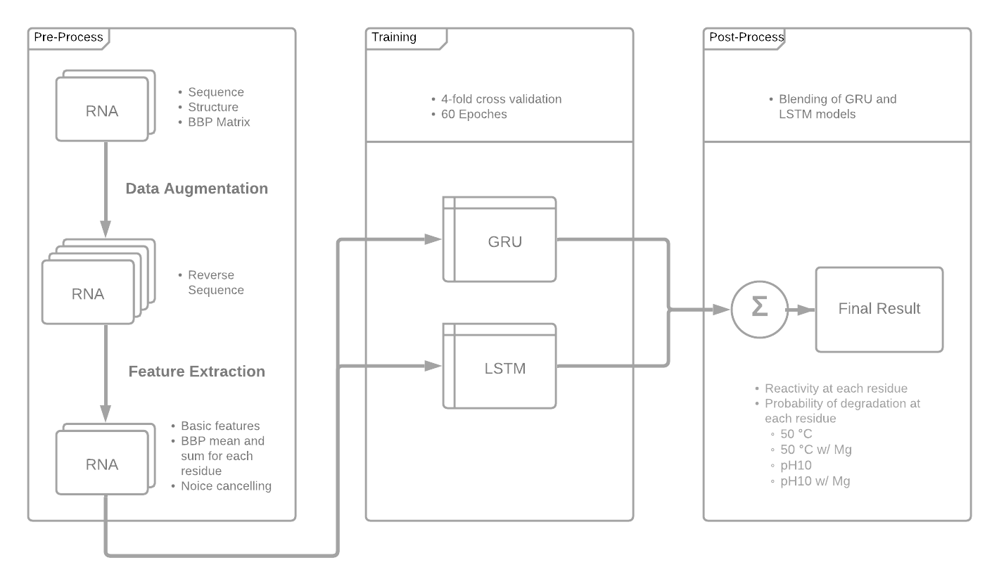

## OpenVaccine: COVID-19 mRNA Vaccine Degradation Prediction

> Repository for my solution to `OpenVaccine: COVID-19 mRNA Vaccine Degradation Prediction` challenge by Stanford and  Kaggle.

Click [here](https://www.kaggle.com/c/stanford-covid-vaccine) for the official website.

## Goal

Predict the reactivity and degradation probability for each base on the mRNA by given mRNA structure and sequence.

## Overview

## Model Architecture

- The main model blends a bi-directional GRU model and a bi-directional LSTM model. 

- Input Summary (`BATCH_SIZE*SEQ_LEN*5`), the 5 features are:
  - Basic Features
    - Nucleotide type `AUCG`
    - Pairing state `(.)`
    - Loop type `ESHBXIM`
  - Extracted Features from Base Pairing Probability (BBP) Matrix
    - BBP sum
    - BBP mean
- Output Summary (`BATCH_SIZE*SEQ_LEN*5`), the 5 labels are:
  - Reactivity
  - Degradation Probability at 50°C
  - Degradation Probability at 50°C w/ Mg
  - Degradation Probability at pH10
  - Degradation Probability at pH10 w/ Mg

## Preprocess

- Data argumentation
  - Revserve Sequence
- Feature Extraction
  - Calculate BBP sum for each residue
  - Calculate BBP mean for each residue
- Noise cancelling
- One-hot Encoding(OHE) Mapping
  - Sequence
  - Structure
  - Loop type

## Training Configuration

- 4 folds of 80 Epochs
- Platform
  - `Auzre STANDARD_NC6: 6 cores, 56 GB RAM, 380 GB disk, 1 x NVIDIA Tesla K80`
  - Est. training for 1 hr on single GPU
  - `PyTorch` implementation 
- Loss Function: customized MCRMSE (Mean Column-wised Root Mean Squared Error)

## Result

- Final Score: 0.26567
- 7% improvement to the single GRU base-line model.

## Reference

Competition Homepage: https://www.kaggle.com/c/stanford-covid-vaccine/overview

Single GRU Baseline Model: https://www.kaggle.com/c/stanford-covid-vaccine/discussion/182303

Notebook Framework: https://www.kaggle.com/xhlulu/openvaccine-simple-gru-model?scriptVersionId=43163749

